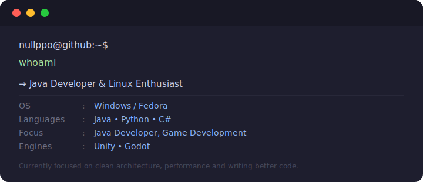

<h3 align="center">Java Developer & Linux Enthusiast</h3>

---

### About

Passionate about building engaging game experiences and writing maintainable, clean code.  
Currently focused on game architecture, systems design, and deepening Linux proficiency.

---

### 🛠️ Stack

**Languages**

  
  
  

**Game Engines & Tools**

  
  
  
  

---

### Currently Working On

- Architectural patterns for scalable game systems
- Performance optimization in Unity/Godot
- Linux tooling and workflow mastery

---

